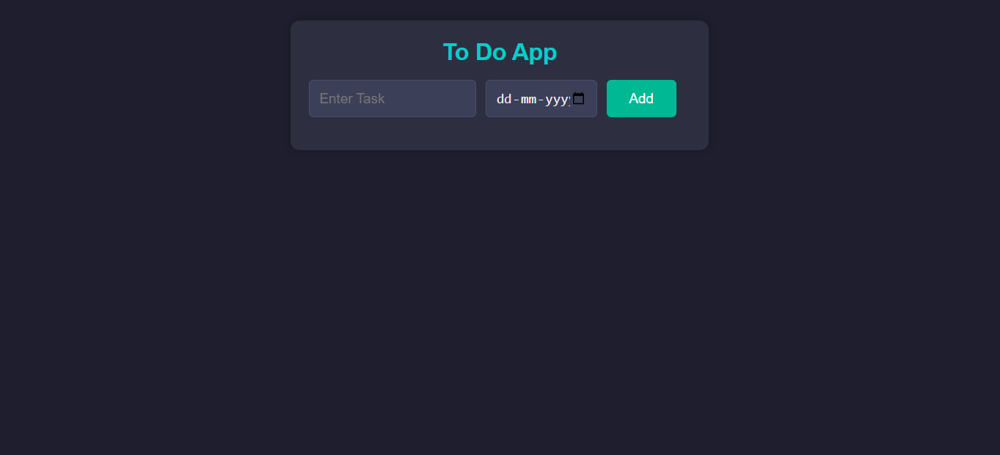

# To-Do App 📝

This is a simple and responsive To-Do List App built using HTML, CSS, and vanilla JavaScript. Users can add tasks along with a date, and all data is stored in the browser using `localStorage`.

## 🔗 Live Demo

[Click here to use the app](https://kaustubh-dalvi1001.github.io/To-Do-App-JavaScript/)

## 📸 Screenshot

## 🚀 Features
- Add tasks with due dates
- Delete tasks
- Persistent data using localStorage
- Responsive design for mobile and desktop

## 🛠️ Technologies Used

- HTML5
- CSS3
- JavaScript (Vanilla)

## 👨‍💻 Author

Kaustubh Dalvi  
📫 GitHub Profile: https://github.com/Kaustubh-Dalvi1001

## 📬 Connect with Me

- [LinkedIn](https://www.linkedin.com/in/kaustubh-dalvi-0431662a8)  
- [GitHub](https://github.com/Kaustubh-Dalvi1001)  
- 📧 kaustubhdalvi1002@gmail.com

---

## ✅ Status

Project completed and deployed.

---

## 📝 License

This project is open source and available under the [MIT License](https://opensource.org/licenses/MIT).
